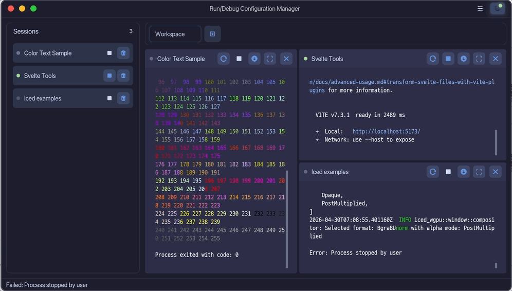
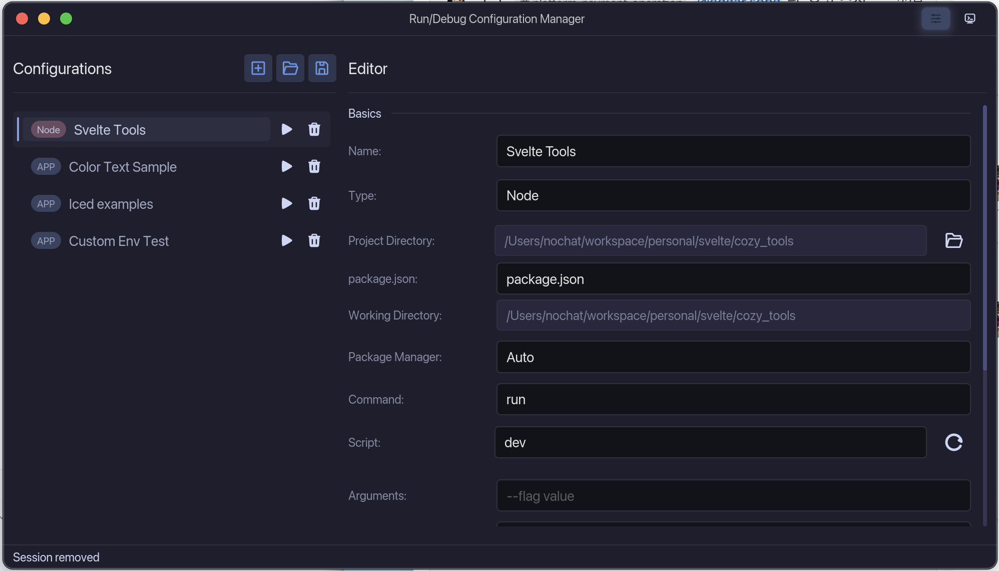
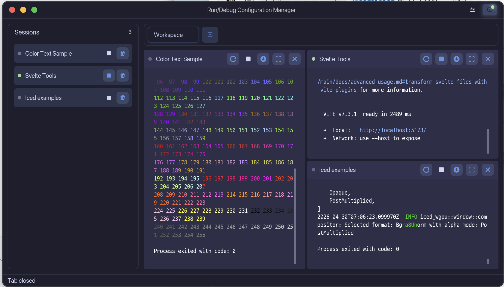
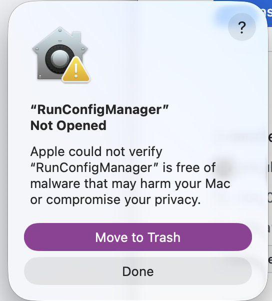
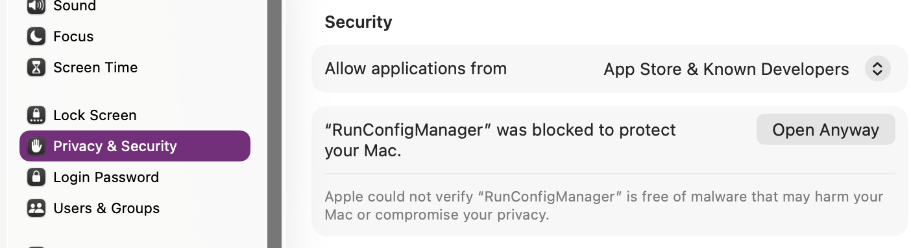

# Run/Debug Configuration Manager

[English](README.md) · **한국어** · [日本語](README_JA.md)

Run/Debug 구성 관리 도구입니다.
Rust와 iced GUI 프레임워크로 개발되었으며, 여러 프로그램 실행 구성을 저장하고 관리할 수 있는 크로스플랫폼 데스크톱 애플리케이션입니다.



## 다운로드

[Releases 페이지](https://github.com/devsepnine/debug_configuration/releases/latest)에서 최신 빌드를 받거나 아래 직링크를 사용하세요:

| 플랫폼 | 파일 |
|---|---|
| Windows x64 | [`run_config_manager-windows-x64.msi`](https://github.com/devsepnine/debug_configuration/releases/latest/download/run_config_manager-windows-x64.msi) |
| macOS (Apple Silicon) | [`run_config_manager-macos-arm64.dmg`](https://github.com/devsepnine/debug_configuration/releases/latest/download/run_config_manager-macos-arm64.dmg) |
| macOS (Intel) | [`run_config_manager-macos-x64.dmg`](https://github.com/devsepnine/debug_configuration/releases/latest/download/run_config_manager-macos-x64.dmg) |
| Linux x64 | [`run_config_manager-linux-x64.tar.gz`](https://github.com/devsepnine/debug_configuration/releases/latest/download/run_config_manager-linux-x64.tar.gz) |
| SHA-256 checksums | [`checksums.txt`](https://github.com/devsepnine/debug_configuration/releases/latest/download/checksums.txt) |

> macOS 사용자: .app 번들은 ad-hoc 서명만 되어 있습니다 (유료 Apple Developer ID 미사용). 첫 실행 시 [macOS 첫 실행](#macos-첫-실행) 섹션을 참고해 허용 처리하세요.

## 주요 기능

### 구성 관리
- 실행 구성 생성, 수정, 삭제
- 구성 타입 선택 (Application, Shell Script, Node)
- 명령어, 인자, 작업 디렉토리 설정
- 환경 변수 관리 (추가, 수정, 삭제)
- 드래그 앤 드롭으로 구성 순서 변경
- 구성 열기/저장 (JSON 형식)

### Node 프로젝트 지원
- Node 기반 명령어 지원 (run, install, start, test, build 등)
- Node Runtime 자동 감지 (system PATH, nvm, nvm-windows)
- package.json 자동 스캔 및 scripts 파싱
- 패키지 매니저 선택 또는 자동 감지 (npm, yarn, pnpm, bun)
- 비동기 초기화로 빠른 앱 시작

### 실행 세션 관리
- 다중 세션 동시 실행
- 실시간 출력 표시 (ANSI 색상 지원)
- 세션 재실행, 중지, 제거, 워크스페이스에서 숨김
- 워크스페이스 열림 상태를 표시하는 세션 리스트
- 워크스페이스 탭 시스템
  - 최소 하나의 워크스페이스 탭 유지
  - 워크스페이스 추가, 닫기, 이름 변경
  - 세션 리스트에서 선택한 워크스페이스로 세션 열기
- Pane 기반 워크스페이스 레이아웃
  - iced pane grid 기반 Pane 분할
  - 드래그 앤 드롭으로 Pane 재배치
  - Pane 리사이징
  - 여러 Pane이 있을 때 최대화/복원 지원

### UI 특징
- Catppuccin Mocha 테마
- D2Coding 폰트 사용
- 터미널 스타일 출력
- 커스텀 윈도우 타이틀바와 둥근 윈도우 크롬
- 툴바, 세션, Pane 버튼의 통일된 아이콘 스타일
- URL 클릭 시 브라우저 열기
- 클립보드 복사 지원
- 자동 스크롤 기능

## 스크린샷

### 구성 관리 화면


### 실행 세션 화면


## 설치 및 실행

### 요구사항
- Rust 1.85 이상
- Cargo

### 빌드
```bash
cargo build --release
```

### 실행
```bash
cargo run --release
```

### Linux 런타임 의존성
Linux에서는 실행 시 몇 가지 데스크톱 서비스에 의존합니다. 일반 데스크톱 세션에는 있지만 최소 구성/헤드리스 환경에서는 없을 수 있으며, 그 경우 해당 기능이 조용히 비활성화됩니다:

- **파일 다이얼로그**(열기 / 저장 / 출력 내보내기)는 D-Bus 기반 XDG Desktop Portal을 사용합니다 — `xdg-desktop-portal`과 백엔드(`xdg-desktop-portal-gtk`, `-kde`, `-hyprland` 등)를 설치·실행하세요.
- **데스크톱 알림**은 `org.freedesktop.Notifications`를 구현하는 알림 데몬이 필요합니다(GNOME/KDE 기본 제공, 없으면 `dunst` / `mako`).
- **URL 열기**는 `xdg-utils`의 `xdg-open`을 사용합니다.
- **렌더링**은 wgpu(Vulkan/GL)를 사용합니다. GPU 드라이버(Mesa) 동작을 권장합니다(tiny-skia 소프트웨어 폴백).

소스 빌드용 시스템 라이브러리는 CI 워크플로에 명시: `libfontconfig1-dev`, `libwayland-dev`, `libx11-xcb-dev`, `libxkbcommon-dev`, `pkg-config`.

### 플랫폼 체크
이 프로젝트는 Windows, macOS, Linux 실행을 목표로 합니다.

아래 target 컴파일 체크를 통과했습니다:
```bash
cargo check --target x86_64-pc-windows-msvc
cargo check --target x86_64-unknown-linux-gnu
cargo check --target x86_64-apple-darwin
cargo check --target aarch64-apple-darwin
```

투명 rounded window corner처럼 OS compositor에 의존하는 시각 표현은 각 플랫폼에서 실제 실행 확인이 필요합니다.

### 자동 릴리스
GitHub Actions는 pull request와 `develop`, `release/**` 브랜치 push에서 CI 검증을 실행합니다.
릴리스 산출물은 4개 플랫폼으로 빌드됩니다:
- Windows x64 — MSI installer
- Linux x64 — desktop entry, icon, install script가 포함된 tarball
- macOS x64 — DMG disk image
- macOS arm64 — DMG disk image

Linux release archive를 설치하려면:
```bash
tar -xzf run_config_manager-linux-x64.tar.gz
cd run_config_manager-linux-x64
./install-linux.sh
```

#### 자동 릴리스 (권장)
`release/vX.Y.Z` 브랜치를 push하면 자동 빌드와 draft GitHub Release가 생성됩니다:
```bash
git checkout -b release/v0.2.0 develop
# Cargo.toml 버전 수정, 마지막 손질
git push -u origin release/v0.2.0
```
워크플로우는 버전 형식(`vX.Y.Z` 또는 `vX.Y.Z-suffix`)을 검증하고 4개 플랫폼을 빌드한 뒤 `checksums.txt`와 함께 draft 릴리스에 업로드합니다.
GitHub Releases 페이지에서 draft를 검토한 뒤 **Publish release** 버튼으로 공개하세요 — 태그는 publish 시점에 브랜치 tip에 생성됩니다.
이후 `release/v0.2.0`을 `develop`으로 머지하세요.

#### 수동 릴리스 (백업)
태그가 이미 존재하거나 브랜치 흐름을 우회해야 한다면 태그를 먼저 push한 뒤 GitHub Actions 탭에서 `Release` 워크플로우를 수동 실행하세요:
```bash
git tag v0.2.0 <commit>
git push origin v0.2.0
```

두 경로 모두 같은 태그의 릴리스가 이미 있으면 중단됩니다.
기존 릴리스의 checksum만 다시 생성해야 할 때만 `Checksum` 워크플로우를 실행하세요.

### macOS 첫 실행

.app 번들은 ad-hoc 서명만 되어 있습니다 (유료 Apple Developer ID 미사용). 첫 실행 시 macOS가 다음 중 하나를 표시할 수 있습니다:
- `Apple could not verify "RunConfigManager" is free of malware...` (macOS 14+)
- `"RunConfigManager" is damaged and can't be opened` (quarantine 속성이 활성일 때)



두 가지 해결 방법:

**방법 1 — 시스템 설정 (권장)**
1. 다이얼로그에서 `Done` 클릭으로 닫기.
2. **시스템 설정 → 개인정보 보호 및 보안** (Privacy & Security) 열기.
3. 보안 섹션에서 `"RunConfigManager" was blocked` 메시지와 **Open Anyway** 버튼 확인.

   

4. **Open Anyway** 클릭 → Touch ID 또는 비밀번호 인증.
5. RunConfigManager 다시 실행 → 정상 동작 (이후 영구 허용).

**방법 2 — 터미널 (한 번에)**
```bash
xattr -dr com.apple.quarantine /Applications/RunConfigManager.app
open /Applications/RunConfigManager.app
```

`com.apple.quarantine` 속성을 제거하여 Gatekeeper 검사 자체를 우회합니다. 다이얼로그 없이 바로 실행됩니다.

## 사용 방법

### 1. 구성 생성
1. `Configurations` 탭에서 `Add` 버튼 클릭
2. 구성 이름, 타입, 명령어 등 설정
3. 필요 시 환경 변수 추가
4. `Save` 버튼으로 저장

### 2. 프로그램 실행
1. 실행할 구성 선택
2. `Run` 버튼 클릭 또는 구성 목록에서 재생 버튼 클릭
3. `Sessions` 탭으로 자동 전환되어 실행 결과 확인

### 3. Pane 관리
- **세션 열기**: 좌측 세션 리스트에서 세션을 클릭해 선택한 워크스페이스에 열기
- **세션 숨김**: Pane의 닫기 버튼으로 실행 중인 세션은 유지한 채 워크스페이스에서만 제거
- **세션 중지/제거**: 세션 리스트 액션 버튼으로 중지 또는 제거
- **Pane 이동**: Pane 헤더를 드래그하여 재배치
- **Pane 크기 조정**: Pane 경계를 드래그하여 리사이징
- **Pane 최대화**: 워크스페이스에 Pane이 2개 이상일 때 최대화 버튼 사용

### 4. 구성 열기/저장
- **Open**: JSON 구성 파일을 열어 현재 구성을 교체
- **Save**: 현재 파일에 저장하거나, 경로가 없으면 저장 위치 선택

## 데이터 저장 위치

구성 파일은 운영체제별 설정 디렉토리에 자동 저장됩니다:
- **Linux**: `~/.config/run_config_manager/configs.json`
- **macOS**: `~/Library/Application Support/run_config_manager/configs.json`
- **Windows**: `%APPDATA%\run_config_manager\configs.json`

## 종료 처리

애플리케이션 종료 시 실행 중인 모든 프로세스를 자동으로 정리합니다:
1. Ctrl+C 또는 창 닫기 시 Drop trait 실행
2. 모든 세션에 SIGTERM (또는 Windows에서 taskkill) 전송
3. 2초 대기 (Graceful shutdown 기회 제공)
4. 남아있는 프로세스 강제 종료 (SIGKILL 또는 taskkill /F)

## 라이선스

이 프로젝트는 GNU General Public License v3.0으로 배포됩니다. 자세한 내용은 [LICENSE](LICENSE)를 참고하세요.
