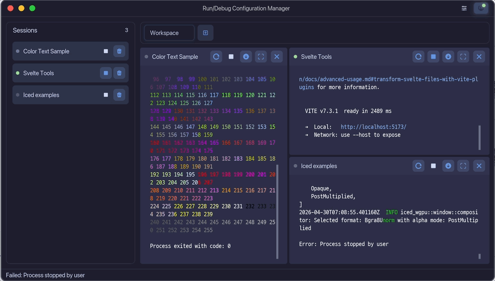
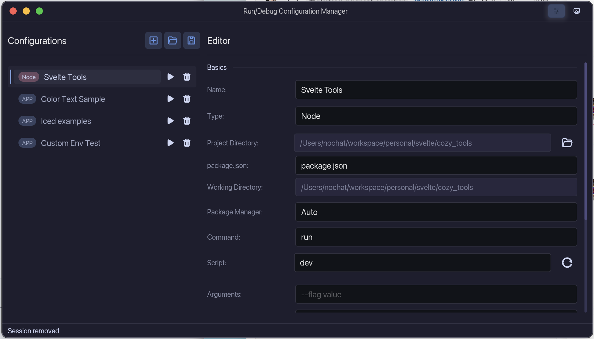
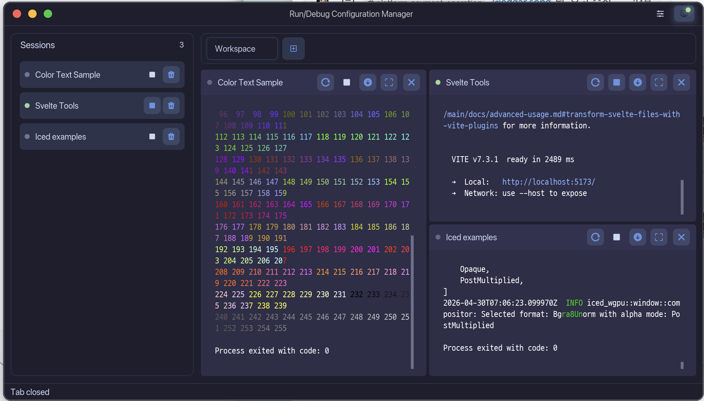
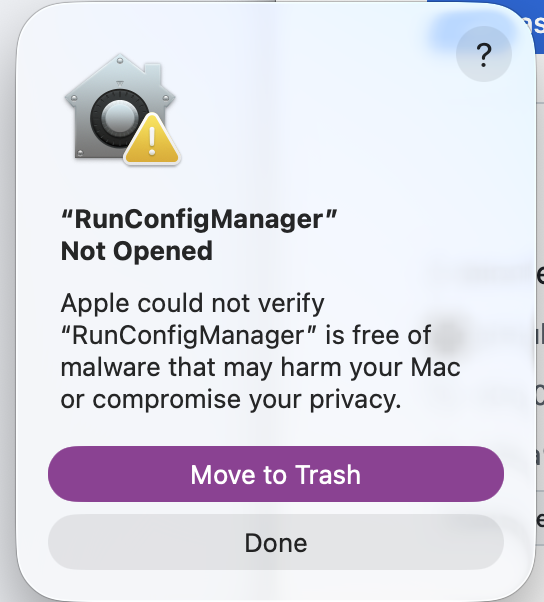
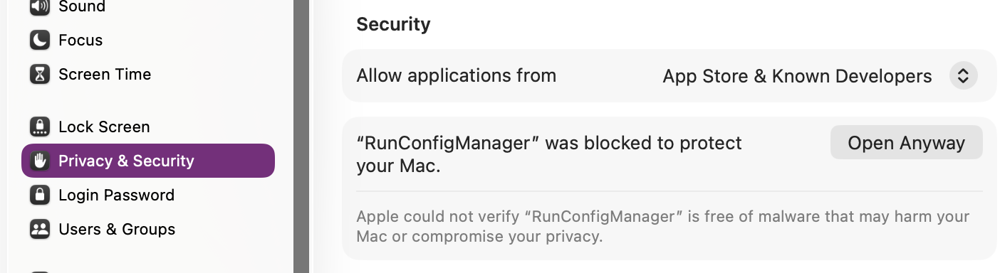

# Run/Debug Configuration Manager

[English](README.md) · **한국어** · [日本語](README_JA.md)

Run/Debug 구성 관리 도구입니다.
Rust와 iced GUI 프레임워크로 개발되었으며, 여러 프로그램 실행 구성을 저장하고 관리할 수 있는 크로스플랫폼 데스크톱 애플리케이션입니다.



## 다운로드

[Releases 페이지](https://github.com/devsepnine/debug_configuration/releases/latest)에서 최신 빌드를 받거나 아래 직링크를 사용하세요:

| 플랫폼 | 파일 |
|---|---|
| Windows x64 | [`run_config_manager-windows-x64.msi`](https://github.com/devsepnine/debug_configuration/releases/latest/download/run_config_manager-windows-x64.msi) |
| macOS (Apple Silicon) | [`run_config_manager-macos-arm64.dmg`](https://github.com/devsepnine/debug_configuration/releases/latest/download/run_config_manager-macos-arm64.dmg) |
| macOS (Intel) | [`run_config_manager-macos-x64.dmg`](https://github.com/devsepnine/debug_configuration/releases/latest/download/run_config_manager-macos-x64.dmg) |
| Linux x64 | [`run_config_manager-linux-x64.tar.gz`](https://github.com/devsepnine/debug_configuration/releases/latest/download/run_config_manager-linux-x64.tar.gz) |
| SHA-256 checksums | [`checksums.txt`](https://github.com/devsepnine/debug_configuration/releases/latest/download/checksums.txt) |

> macOS 사용자: .app 번들은 ad-hoc 서명만 되어 있습니다 (유료 Apple Developer ID 미사용). 첫 실행 시 [macOS 첫 실행](#macos-첫-실행) 섹션을 참고해 허용 처리하세요.

## 주요 기능

### 구성 관리
- 실행 구성 생성, 수정, 복제, 삭제
- 구성 타입 선택 (Application, Shell Script, Node, Kotlin, Spring Boot, Compound)
- Compound 타입은 여러 구성을 묶어 한 번에 실행
- 명령어, 인자, 작업 디렉토리 설정
- Shell Script 인라인 스크립트를 멀티라인 에디터로 작성 (고정폭 폰트,
  Enter로 개행, 높이 유계 + 내부 스크롤)
- 환경 변수 관리 (추가, 수정, 삭제)
- 드래그 앤 드롭으로 구성 순서 변경
- 구성 열기/저장 (버전 관리 JSON 형식)

### Node 프로젝트 지원
- Node 기반 명령어 지원 (run, install, start, test, build 등)
- Node Runtime 자동 감지 (system PATH, nvm, nvm-windows)
- package.json 자동 스캔 및 scripts 파싱
- 패키지 매니저 선택 또는 자동 감지 (npm, yarn, pnpm, bun)
- 비동기 초기화로 빠른 앱 시작

### Kotlin 지원
- `java`로 Kotlin/JVM 앱 실행 — Main class 또는 JAR 실행 모드
- VM options(예: `-Xmx2g`)와 프로그램 인자 설정
- JDK 자동 감지 (JAVA_HOME, SDKMAN, macOS/Linux/Windows 표준 위치) + 수동 지정

### Spring Boot 지원
- Auto / Gradle(`bootRun`) / Maven(`spring-boot:run`) / JAR 빌드 도구로 Spring Boot 앱 실행
- Auto는 작업 디렉터리에서 `gradlew` > `mvnw` > `build.gradle(.kts)`/`settings.gradle(.kts)` > `pom.xml` 순으로 감지하며(JAR로 폴백하지 않음), wrapper는 작업 디렉터리와 최대 3단계 상위 디렉터리까지 찾습니다
- Auto에서 작업 디렉터리가 잘못되면 명령 배너 없이 오류만 표시됩니다
- 멀티모듈: **Module**로 실행할 모듈을 하나 지정합니다. Gradle은 프로젝트 경로(`:app`, `:services:api`, `app/api`)로 `:app:bootRun`을 실행하고, Maven은 `-pl` 값(`app/api` 또는 `:artifactId`)을 씁니다. 멀티모듈 루트에서 한정자 없는 `bootRun`은 모든 모듈에서 실행되어 main class가 없는 모듈에서 실패합니다
- **Module** 옆 새로고침 버튼으로 모듈을 감지합니다: `src/main`에서 `@SpringBootApplication`을 찾고(`build`, `target`, 숨김·의존성 디렉터리는 건너뛰며 심볼릭 링크는 따라가지 않음), 후보가 하나이고 입력이 비어 있으면 자동으로 채우고 아니면 드롭다운에 후보를 보여줍니다. Gradle `projectDir`을 기본값과 다르게 매핑한 프로젝트는 감지 경로가 틀릴 수 있습니다
- Maven은 `-am` 없이 `-pl <module> spring-boot:run`을 실행하므로 형제 모듈이 미리 설치돼 있어야 합니다(`mvn install`). 허용 문자는 영문·숫자·`_ . - : /`이며 `::`, `//`, `..`, 앞자리 `/` 또는 `-`는 불가합니다
- Spring 프로파일(영문·숫자·`_ . , -`만 허용), VM 옵션, 프로그램 인자 설정
- JDK 선택(자동 감지 목록 또는 직접 경로) — Gradle/Maven에서는 `JAVA_HOME`으로 적용
- Gradle은 VM 옵션을 `JAVA_TOOL_OPTIONS`로 전달합니다. 이미 실행 중인 Gradle 데몬은 무시할 수 있고 출력에 "Picked up JAVA_TOOL_OPTIONS"가 섞입니다
- 프로그램 인자는 JAR 모드에서는 셸에 그대로, Gradle/Maven에서는 하나의 인용된 옵션 값으로 전달됩니다
- 환경 변수에 직접 지정한 `JAVA_HOME`이 선택한 JDK에서 파생한 값보다 우선합니다
- 참고: 저장되는 구성 파일이 포맷 버전 2로 바뀌어, 이전 버전 앱은 "newer version" 안내를 표시하며 파일을 열지 않습니다

### 실행 세션 관리
- 다중 세션 동시 실행
- 모든 플랫폼에서 진짜 터미널 실행: macOS/Linux는 PTY, Windows 10 1809+는
  ConPTY — 프로그램이 실제 콘솔을 감지해 색상·진행바·대화형 프롬프트가 실제
  셸처럼 동작 (뷰포트 연동 resize; unix는 `TERM=xterm-256color`)
- 라이브 한 줄 진행바 (캐리지 리턴 재그리기를 제자리에서 렌더; 백스페이스 소거)
- 세션별 stdin 입력바 (토글 버튼 또는 Cmd+I): 프롬프트 응답·REPL 입력 —
  터미널이 에코를 자연 처리, 구형 Windows pipe 폴백(1809 미만)만 앱이 로컬 에코.
  제출한 라인은 세션별 히스토리로 저장(↑/↓로 재호출), ^C 버튼 또는 입력창
  포커스 중 Ctrl+C로 인터럽트 전송, ^D / Ctrl+D로 EOF 전송(REPL·stdin 리더 종료)
- 실시간 출력 표시 (ANSI 색상 지원; OSC/DCS 제어 시퀀스는 걸러냄)
- 세션 재실행, 중지, 제거, 워크스페이스에서 숨김
- 완료된 세션의 상태 배지 (성공 / 실패 종료 코드 / 실행 시간)
- 종료된 세션은 살짝 어둡게 표시되어 실행 중인 Pane과 한눈에 구분
- 창이 비활성 상태에서 실행이 끝나면 데스크톱 알림
- 일괄 작업: 모두 중지, 모두 재실행, 실패만 재실행
- 워크스페이스 열림 상태를 표시하는 세션 리스트
- 실행 중인 세션은 목록 위쪽에 유지되고, 종료된 세션은 개수를 표시한
  구분선 아래로 내려감
- 워크스페이스 탭 시스템
  - 최소 하나의 워크스페이스 탭 유지
  - 워크스페이스 추가, 닫기, 이름 변경
  - 세션 리스트에서 선택한 워크스페이스로 세션 열기
- Pane 기반 워크스페이스 레이아웃
  - iced pane grid 기반 Pane 분할
  - 드래그 앤 드롭으로 Pane 재배치
  - Pane 리사이징
  - 여러 Pane이 있을 때 최대화/복원 지원
  - 좁은 Pane에서는 컴팩트 오버플로(⋯) 메뉴 제공, Pane마다 독립적으로 열림

### 출력 검색 및 내보내기
- 출력 검색 (Ctrl+F): 대소문자 무시 부분일치 또는 정규식
- 매치 라인 하이라이트, 이전/다음 이동, 매치 개수 표시
- 매치 라인만 표시하는 필터 모드
- 세션 출력 전체를 텍스트/로그 파일로 내보내기

### UI 특징
- Catppuccin Mocha 테마
- D2Coding 폰트 사용
- 터미널 스타일 출력
- 커스텀 윈도우 타이틀바와 둥근 윈도우 크롬
- 툴바, 세션, Pane 버튼의 통일된 아이콘 스타일
- URL 클릭 시 브라우저 열기
- 클립보드 복사 지원
- 자동 스크롤 기능

## 스크린샷

### 구성 관리 화면


### 실행 세션 화면


## 설치 및 실행

### 요구사항
- Rust 1.85 이상
- Cargo

### 빌드
```bash
cargo build --release
```

### 실행
```bash
cargo run --release
```

### Linux 런타임 의존성
Linux에서는 실행 시 몇 가지 데스크톱 서비스에 의존합니다. 일반 데스크톱 세션에는 있지만 최소 구성/헤드리스 환경에서는 없을 수 있으며, 그 경우 해당 기능이 조용히 비활성화됩니다:

- **파일 다이얼로그**(열기 / 저장 / 출력 내보내기)는 D-Bus 기반 XDG Desktop Portal을 사용합니다 — `xdg-desktop-portal`과 백엔드(`xdg-desktop-portal-gtk`, `-kde`, `-hyprland` 등)를 설치·실행하세요.
- **데스크톱 알림**은 `org.freedesktop.Notifications`를 구현하는 알림 데몬이 필요합니다(GNOME/KDE 기본 제공, 없으면 `dunst` / `mako`).
- **URL 열기**는 `xdg-utils`의 `xdg-open`을 사용합니다.
- **렌더링**은 wgpu(Vulkan/GL)를 사용합니다. GPU 드라이버(Mesa) 동작을 권장합니다(tiny-skia 소프트웨어 폴백).

소스 빌드용 시스템 라이브러리는 CI 워크플로에 명시: `libfontconfig1-dev`, `libwayland-dev`, `libx11-xcb-dev`, `libxkbcommon-dev`, `pkg-config`.

### 플랫폼 체크
이 프로젝트는 Windows, macOS, Linux 실행을 목표로 합니다.

아래 target 컴파일 체크를 통과했습니다:
```bash
cargo check --target x86_64-pc-windows-msvc
cargo check --target x86_64-unknown-linux-gnu
cargo check --target x86_64-apple-darwin
cargo check --target aarch64-apple-darwin
```

투명 rounded window corner처럼 OS compositor에 의존하는 시각 표현은 각 플랫폼에서 실제 실행 확인이 필요합니다.

### 자동 릴리스
GitHub Actions는 pull request와 `develop`, `release/**` 브랜치 push에서 CI 검증을 실행합니다.
릴리스 산출물은 4개 플랫폼으로 빌드됩니다:
- Windows x64 — MSI installer
- Linux x64 — desktop entry, icon, install script가 포함된 tarball
- macOS x64 — DMG disk image
- macOS arm64 — DMG disk image

Linux release archive를 설치하려면:
```bash
tar -xzf run_config_manager-linux-x64.tar.gz
cd run_config_manager-linux-x64
./install-linux.sh
```

#### 자동 릴리스 (권장)
`release/vX.Y.Z` 브랜치를 push하면 자동 빌드와 draft GitHub Release가 생성됩니다:
```bash
git checkout -b release/v0.2.0 develop
# Cargo.toml 버전 수정, 마지막 손질
git push -u origin release/v0.2.0
```
워크플로우는 버전 형식(`vX.Y.Z` 또는 `vX.Y.Z-suffix`)을 검증하고 4개 플랫폼을 빌드한 뒤 `checksums.txt`와 함께 draft 릴리스에 업로드합니다.
GitHub Releases 페이지에서 draft를 검토한 뒤 **Publish release** 버튼으로 공개하세요 — 태그는 publish 시점에 브랜치 tip에 생성됩니다.
이후 `release/v0.2.0`을 `develop`으로 머지하세요.

#### 수동 릴리스 (백업)
태그가 이미 존재하거나 브랜치 흐름을 우회해야 한다면 태그를 먼저 push한 뒤 GitHub Actions 탭에서 `Release` 워크플로우를 수동 실행하세요:
```bash
git tag v0.2.0 <commit>
git push origin v0.2.0
```

두 경로 모두 같은 태그의 릴리스가 이미 있으면 중단됩니다.
기존 릴리스의 checksum만 다시 생성해야 할 때만 `Checksum` 워크플로우를 실행하세요.

### macOS 첫 실행

.app 번들은 ad-hoc 서명만 되어 있습니다 (유료 Apple Developer ID 미사용). 첫 실행 시 macOS가 다음 중 하나를 표시할 수 있습니다:
- `Apple could not verify "RunConfigManager" is free of malware...` (macOS 14+)
- `"RunConfigManager" is damaged and can't be opened` (quarantine 속성이 활성일 때)



두 가지 해결 방법:

**방법 1 — 시스템 설정 (권장)**
1. 다이얼로그에서 `Done` 클릭으로 닫기.
2. **시스템 설정 → 개인정보 보호 및 보안** (Privacy & Security) 열기.
3. 보안 섹션에서 `"RunConfigManager" was blocked` 메시지와 **Open Anyway** 버튼 확인.

   

4. **Open Anyway** 클릭 → Touch ID 또는 비밀번호 인증.
5. RunConfigManager 다시 실행 → 정상 동작 (이후 영구 허용).

**방법 2 — 터미널 (한 번에)**
```bash
xattr -dr com.apple.quarantine /Applications/RunConfigManager.app
open /Applications/RunConfigManager.app
```

`com.apple.quarantine` 속성을 제거하여 Gatekeeper 검사 자체를 우회합니다. 다이얼로그 없이 바로 실행됩니다.

## 사용 방법

### 1. 구성 생성
1. `Configurations` 탭에서 `Add` 버튼 클릭
2. 구성 이름, 타입, 명령어 등 설정
3. 필요 시 환경 변수 추가
4. `Save` 버튼으로 저장

### 2. 프로그램 실행
1. 실행할 구성 선택
2. `Run` 버튼 클릭 또는 구성 목록에서 재생 버튼 클릭
3. `Sessions` 탭으로 자동 전환되어 실행 결과 확인

### 3. Pane 관리
- **세션 열기**: 좌측 세션 리스트에서 세션을 클릭해 선택한 워크스페이스에 열기
- **세션 숨김**: Pane의 닫기 버튼으로 실행 중인 세션은 유지한 채 워크스페이스에서만 제거
- **세션 중지/제거**: 세션 리스트 액션 버튼으로 중지 또는 제거
- **Pane 이동**: Pane 헤더를 드래그하여 재배치
- **Pane 크기 조정**: Pane 경계를 드래그하여 리사이징
- **Pane 최대화**: 워크스페이스에 Pane이 2개 이상일 때 최대화 버튼 사용

### 4. 구성 열기/저장
- **Open**: JSON 구성 파일을 열어 현재 구성을 교체
- **Save**: 현재 파일에 저장하거나, 경로가 없으면 저장 위치 선택

## AI 연동 (MCP)

앱이 로컬 MCP 서버를 열어, 외부 AI 에이전트(Claude Code 등 MCP 클라이언트)가 구성 조회 ·
실행 · 세션 출력 읽기 · 구성 편집을 하게 할 수 있다. 앱이 LLM을 호출하지는 않는다.

기본값은 꺼짐 · 읽기 전용이다 — 직접 켤 때까지 리스너가 뜨지 않는다.

1. `Settings` → `AI (MCP)` → `Enable local MCP server`, `Permission` 단계 선택, `OK`
2. `Register with Claude Code` 행의 복사 아이콘(실제 토큰이 박힌다 — 화면에 보이는 것은
   마스킹)으로 명령을 복사해 실행한다:

```bash
claude mcp add --transport http runconfig http://127.0.0.1:47355/mcp \
  -H "Authorization: Bearer <token>"
```

| 단계 | 툴 |
|---|---|
| `Read only` (기본) | 구성 목록·상세, 세션 목록, 세션 출력 읽기·검색 |
| `Execute` | + 실행, 중지, 재실행, stdin 한 줄 전송 |
| `Edit` | + 구성 생성·수정·삭제 |

- 루프백 전용(`127.0.0.1`), Bearer 토큰 필수, 루프백이 아닌 `Origin`은 거부
- 토큰은 `~/.run_config_mcp_token`에 있고(unix `0600`) 설정 파일에는 들어가지 않는다.
  Windows는 사용자 프로필 디렉터리 ACL에 의존한다
- 등록 명령을 터미널에 붙이면 토큰이 셸 히스토리에 남는다 — 그 줄을 지우거나, 등록 후
  `Token` 행의 재생성 아이콘으로 무효화한다
- `Expose environment variable values`를 켜지 않으면 환경변수 값이 `<hidden>`으로 가려진다
- `Execute`는 사실상 임의 명령 실행이고, `Edit`은 확인 모달 없이 저장된 데이터를 바꾼다.
  필요한 만큼만 올린다
- 변경성 호출은 앱 상태바에 `[MCP]` 접두사로 남는다

툴별 동작 · 재시도 규칙(`request_id`) · 입력 상한 · 오류 코드 전체는
[docs/MCP.md](docs/MCP.md)에 있다.

## 데이터 저장 위치

구성 파일은 운영체제별 설정 디렉토리에 자동 저장됩니다:
- **Linux**: `~/.config/run_config_manager/configs.json`
- **macOS**: `~/Library/Application Support/run_config_manager/configs.json`
- **Windows**: `%APPDATA%\run_config_manager\configs.json`

## 알려진 한계

- **풀스크린 TUI 앱은 비지원**: 터미널이 스크린 그리드가 아니라 라인 스크롤백
  렌더러라 `vim`, `htop`, `less` 같은 alt-screen 프로그램은 화면이 깨집니다
  (앱은 정상 동작 — Stop으로 복구). `input()`, `read`, REPL 같은 라인 기반
  대화형 프롬프트는 동작합니다. 탭 문자는 리터럴로 표시됩니다(컬럼 확장 없음).
- **Windows 특이사항**: ConPTY는 이미 렌더링된 VT 스트림을 전달하고 앱은 이를
  라인 스크롤백으로 표시합니다 — 커서 위주 편집은 라인 단위로 근사됩니다
  (백스페이스 소거, 캐리지 리턴 라인 재작성). 실행 중 세션에는 pane 리사이즈가
  전파되지 않습니다 (ConPTY는 라이브 리사이즈에 전체 리페인트로 응답해 스크롤백에
  출력이 중복됨) — 새 크기는 다음 실행/재실행부터 적용됩니다. 새 세션은 가장
  최근 관측된 pane 크기로 시작하며(관측 전엔 120×40), 이 추정이 빗나간 경우에도
  다음 실행/재실행까지 유지됩니다. Stop은 `taskkill /T /F` 하드
  종료라 종료 코드가 보통 1로 보고됩니다(드물게 259/STILL_ACTIVE 관측 가능).
  자식 종료 후 ~300ms간 침묵한 손자 프로세스의 이후 출력은 잘립니다(unix는
  실제 EOF까지 유지). ConPTY가 없는 Windows 10 1809 미만은 pipe로 폴백 —
  색상/진행바 없음, 로컬 에코, 인터럽트(^C) 전달 불가, 세션에 배너 표시.
  예기치 않은 PowerShell 프롬프트 대기(행처럼 보임 — Stop으로 종료) 노트는
  이 폴백에만 해당합니다.
- **stdin 입력바의 Ctrl+C는 인터럽트**: 세션 stdin 입력창이 포커스일 때 Ctrl+C는
  항상 프로세스로 인터럽트를 보냅니다. Windows/Linux에서 입력창에 선택 영역이
  있으면 복사도 함께 수행됩니다. 출력 영역 복사와 macOS의 Cmd+C 복사에는 영향이
  없습니다.
- **Ctrl+D는 EOF**: 실제 터미널처럼 줄 시작에서 동작합니다 — stdin 입력바의
  미제출 드래프트는 먼저 전송되지 않습니다(Enter로 제출 후 Ctrl+D). Windows는
  내부적으로 콘솔 EOF 시퀀스(Ctrl+Z+Enter)를 전달하고, 구형 pipe 폴백은 stdin
  핸들을 닫는 방식으로 EOF를 만듭니다.
- macOS/Linux에서 `sh -l` + 진짜 tty 조합이라 셸 프로파일의 배너가 세션 출력에
  나타날 수 있습니다.

## 종료 처리

애플리케이션 종료 시 실행 중인 모든 프로세스를 자동으로 정리합니다:
1. Ctrl+C 또는 창 닫기 시 Drop trait 실행
2. Unix: 세션별 프로세스 그룹에 즉시 SIGKILL (유예 없음 — graceful한
   SIGTERM 대기는 Stop 버튼 경로 전용; 종료 중인 UI 스레드를 그만큼
   블록하면 창이 멈춤)
3. Windows: 즉시 `taskkill /T /F` — ConPTY에는 graceful 신호 경로가 없어
   트리를 강제 종료

## 라이선스

이 프로젝트는 GNU General Public License v3.0으로 배포됩니다. 자세한 내용은 [LICENSE](LICENSE)를 참고하세요.
